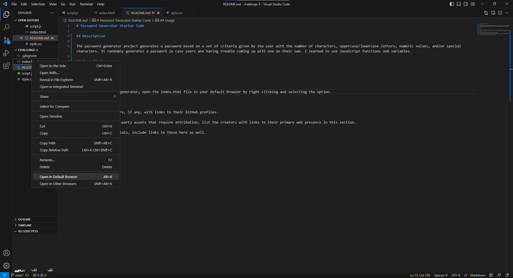
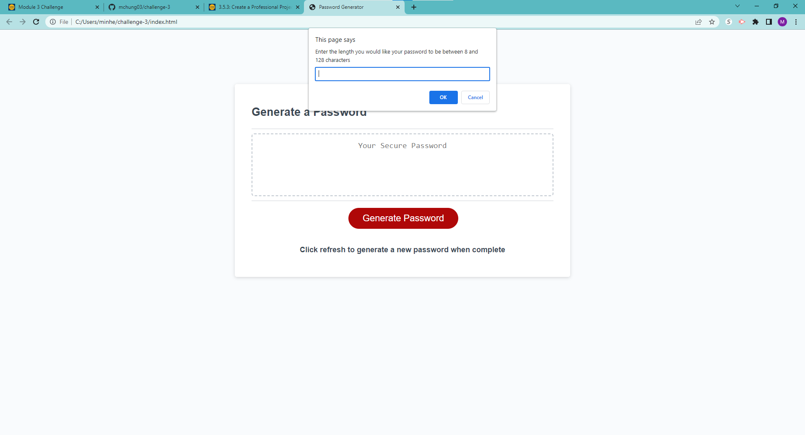
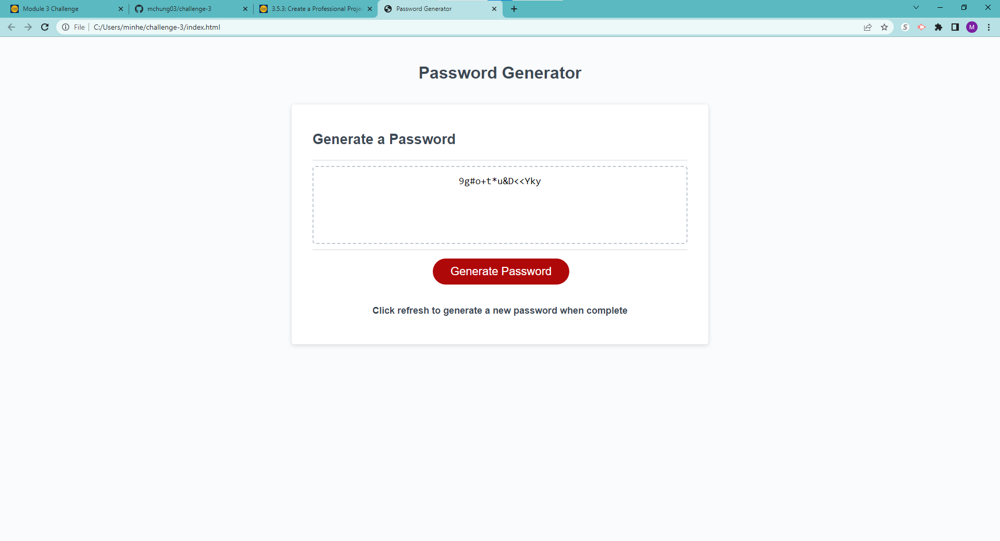

# Password Generator Starter Code

## Description

The password generator project generates a password based on a set of criteria given by the user with the number of characters, uppercase/lowercase letters, numeric values, and/or special characters. It randomly generates a password in case users are having trouble coming up with one on their own. I learned to use JavaScript functions and variables.

## Installation

N/A

## Usage

To use this password generator, open the index.html file in your default browser by right clicking and selecting the option. 

Enter in a value in between 8-128 characters.

Follow the directions, clicking "Ok" for yes and "Cancel" for no.

This is an example of a password of 15 characters that is generated by selecting Yes for all prompts given. (Uppercase letters, lowercase letters, numerical values, and special characters)

## Credits

List your collaborators, if any, with links to their GitHub profiles.

If you used any third-party assets that require attribution, list the creators with links to their primary web presence in this section.

If you followed tutorials, include links to those here as well.