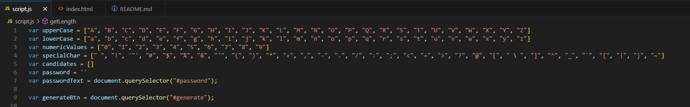
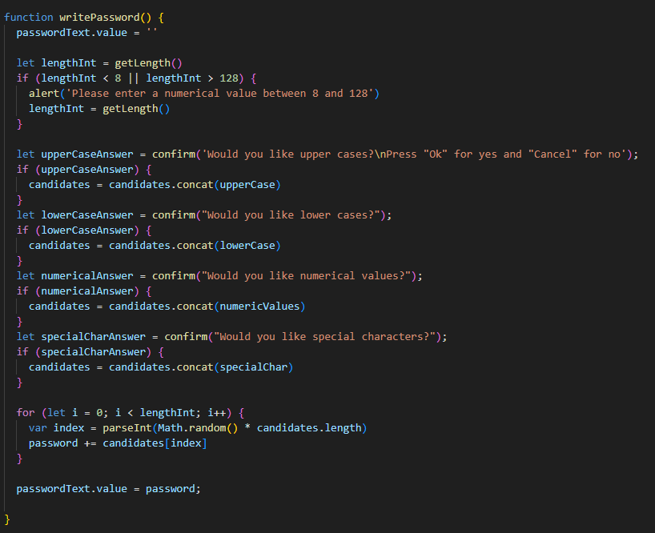
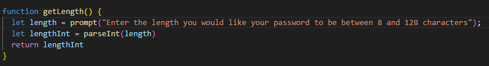
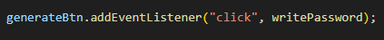

# Password Generator Starter Code

## Description

The password generator project generates a password based on a set of criteria given by the user with the number of characters, uppercase/lowercase letters, numeric values, and/or special characters. It randomly generates a password in case users are having trouble coming up with one on their own. I learned to use JavaScript functions and variables.

## Installation

N/A

## Usage

To use this password generator, open the index.html file in your default browser by right clicking and selecting the option. 

Enter in a value in between 8-128 characters.

Follow the directions, clicking "Ok" for yes and "Cancel" for no.

This is an example of a password of 15 characters that is generated by selecting Yes for all prompts given. (Uppercase letters, lowercase letters, numerical values, and special characters)

These are the relevant variables, as well as the arrays that the passwords are pulling randomly from.

The function, writePassword, has many alert and confirm windows that has the user select options to make the password they desire. 

The function, getLength, tells the user to input a value in between 8-128 characters with a prompt function. If failed, it runs the variable alert to remind the user to input a value within 8-128 characters.

And all of the code above is possible because of this line that starts the whole code when clicked!

I also added a "click refresh to generate a new passcode" heading below the button in the HTML because without clicking refresh, the new passcode just gets added to the end of the previous one.

## Credits

Jili Jiang (tutor): I came up with all the variables and arrays, as well as the initial idea to use the prompt/alert/confirm windows with if statements and she helped me to put it all together with the let variables, concat method and coming up with functions. 

w3schools: https://www.w3schools.com/jsref/met_win_alert.asp
https://www.w3schools.com/jsref/met_win_confirm.asp
https://www.w3schools.com/jsref/met_win_prompt.asp
https://www.w3schools.com/jsref/jsref_concat_array.asp

bobbyhadz.com: https://bobbyhadz.com/blog/javascript-check-if-number-between-two-numbers